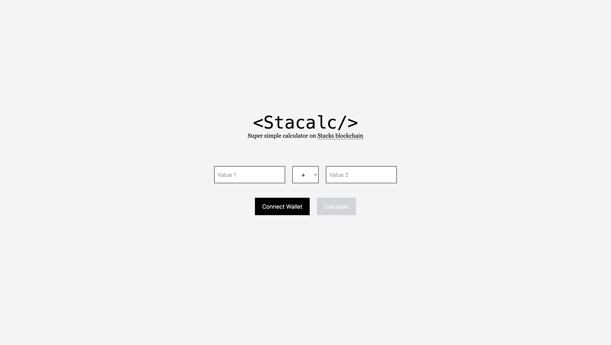

# Stacalc

Stacalc is a super simple on-chain calculator application on [Stack blockchain](https://stacks.co). 



This application will run with the pre-deployed smart contract. If you want to deploy your own smart contract, you can deploy the smart contract located at `/smart_contract/contracts/calculator.clar`. Make sure to change the Front-End configuration at `/src/lib/config.js`.

## Live Demo

You can try the live demo of Stacalc in https://stacalc.vercel.app/

## Features

- Connect & disconnect wallet
- Addition
- Subtraction
- Multiplication
- Division
## Technical Specification

Here is the technical specification that is being used in this application.

| Name | Description |
| - | - |
| Blockchain | [Stacks](https://stacks.co) |
| Smart Contract Language | [Clarity](http://clarity-lang.org/) |
| Front-End | [ReactJS](https://reactjs.org/) |
| Local DevTool | [Clarinet](https://github.com/hirosystems/clarinet) |
| Smart Contract Deployer | [Stack Explorer Sandbox](https://explorer.stacks.co/sandbox/deploy?chain=testnet) |


## Running This Project

If you want to run this project on your local machine, please follow this guide.

### Requirements

Before you run this project, you need to have these installed:
- `Git`
- `NodeJS`
- [Hiro wallet](https://wallet.hiro.so/wallet/install-web)

### Run Locally

Clone the project

```bash
  git clone https://github.com/dkhd/stacalc
```

Go to the project directory

```bash
  cd stacalc
```

Install dependencies

```bash
  npm install
```

Start the server

```bash
  npm run start
```

## Tutorial

If you want to read the step-by-step tutorial, please refer to the [Tutorial page](./docs/tutorial.md).

## License

MIT License

Copyright (c) 2022 Diky Hadna

Permission is hereby granted, free of charge, to any person obtaining a copy of this software and associated documentation files (the "Software"), to deal in the Software without restriction, including without limitation the rights to use, copy, modify, merge, publish, distribute, sublicense, and/or sell copies of the Software, and to permit persons to whom the Software is furnished to do so, subject to the following conditions:

The above copyright notice and this permission notice shall be included in all copies or substantial portions of the Software.

THE SOFTWARE IS PROVIDED "AS IS", WITHOUT WARRANTY OF ANY KIND, EXPRESS OR IMPLIED, INCLUDING BUT NOT LIMITED TO THE WARRANTIES OF MERCHANTABILITY, FITNESS FOR A PARTICULAR PURPOSE AND NONINFRINGEMENT. IN NO EVENT SHALL THE AUTHORS OR COPYRIGHT HOLDERS BE LIABLE FOR ANY CLAIM, DAMAGES OR OTHER LIABILITY, WHETHER IN AN ACTION OF CONTRACT, TORT OR OTHERWISE, ARISING FROM, OUT OF OR IN CONNECTION WITH THE SOFTWARE OR THE USE OR OTHER DEALINGS IN THE SOFTWARE.
